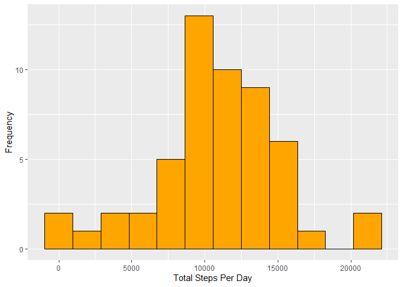
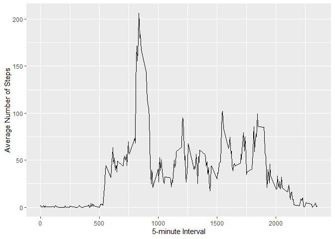
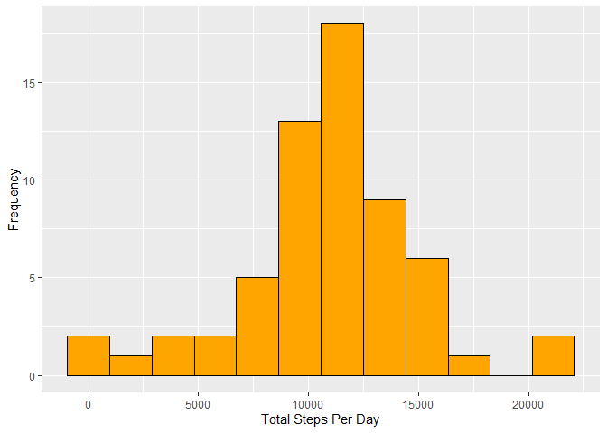
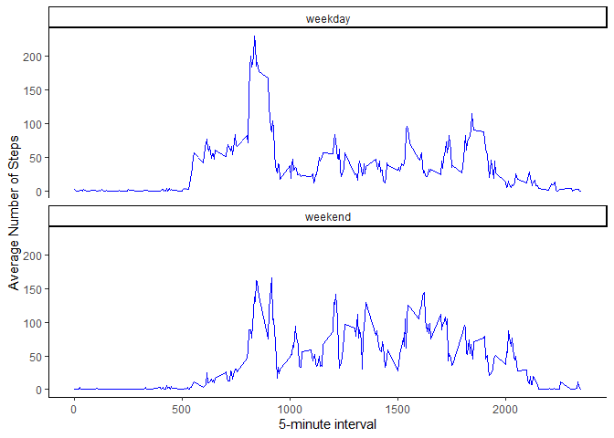

## Getting Started

To retrive the data, the user must clone the associated github repository (https://github.com/rdpeng/RepData_PeerAssessment1.git). The data must be in the users current working directory.

The following library packages are required to run this code.


```r
library(ggplot2)
```

```
## Warning: package 'ggplot2' was built under R version 4.2.3
```

```r
library(ggthemes)
```

```
## Warning: package 'ggthemes' was built under R version 4.2.3
```

```r
library(dplyr)
```

```
## Warning: package 'dplyr' was built under R version 4.2.3
```

```
## 
## Attaching package: 'dplyr'
```

```
## The following objects are masked from 'package:stats':
## 
##     filter, lag
```

```
## The following objects are masked from 'package:base':
## 
##     intersect, setdiff, setequal, union
```

## Loading and preprocessing the data

Once the working directory is established, unzip the data set using the unzip function, and load it using read.csv. The str function tells us that 'date' is a character variable, so change this to a date variable.   


```r
unzip("activity.zip")
activity <- read.csv("activity.csv")

str(activity)
```

```
## 'data.frame':	17568 obs. of  3 variables:
##  $ steps   : int  NA NA NA NA NA NA NA NA NA NA ...
##  $ date    : chr  "2012-10-01" "2012-10-01" "2012-10-01" "2012-10-01" ...
##  $ interval: int  0 5 10 15 20 25 30 35 40 45 ...
```

```r
activity$date <-  as.Date(activity$date)
```

## What is mean total number of steps taken per day?

First, the data needs to be grouped by day. To do this, we can use the group_by function and summarise from the dplyr package.  


```r
total_daily_steps <- activity |> 
    group_by(date) |> 
    summarise(daily_steps = sum(steps))

head(total_daily_steps)
```

```
## # A tibble: 6 × 2
##   date       daily_steps
##   <date>           <int>
## 1 2012-10-01          NA
## 2 2012-10-02         126
## 3 2012-10-03       11352
## 4 2012-10-04       12116
## 5 2012-10-05       13294
## 6 2012-10-06       15420
```

At this point, we can make a histogram to see the distribution of the data using ggplot2 package. The number of bins can be changed if needed.    


```r
histogram <- ggplot(total_daily_steps, aes(daily_steps)) +
    geom_histogram(bins = 12, fill = "orange", col = "black") +
    xlab("Total Steps Per Day") +
    ylab("Frequency")

histogram
```

```
## Warning: Removed 8 rows containing non-finite outside the scale range
## (`stat_bin()`).
```

<!-- -->

Finally, using the grouped data, calculate the mean and median of the total number of steps taken per day. 


```r
mean(total_daily_steps$daily_steps, na.rm = TRUE)
```

```
## [1] 10766.19
```

```r
median(total_daily_steps$daily_steps, na.rm = TRUE)
```

```
## [1] 10765
```

## What is the average daily activity pattern?

Next, make a time series plot of the 5-minute interval and the average number of steps taken, average across all days. This question requires that we group the data by 5-minute interval.


```r
avg_steps_per_interval <- activity |> 
    group_by(interval) |> 
    summarise(avg_steps = mean(steps, na.rm = TRUE))
head(avg_steps_per_interval)
```

```
## # A tibble: 6 × 2
##   interval avg_steps
##      <int>     <dbl>
## 1        0    1.72  
## 2        5    0.340 
## 3       10    0.132 
## 4       15    0.151 
## 5       20    0.0755
## 6       25    2.09
```

Once the data is grouped, use ggplot2 to create a time series plot, using the grouped data. 


```r
time_series <- ggplot(avg_steps_per_interval, aes(x = interval, y = avg_steps)) +
    geom_line() +
    xlab("5-minute Interval") +
    ylab("Average Number of Steps")

time_series
```

<!-- -->

Next, find the 5-minute interval with the maximum number of steps.


```r
avg_steps_per_interval[which.max(avg_steps_per_interval$avg_steps),]$interval
```

```
## [1] 835
```

## Imputing missing values

In this step, the NAs are managed. First, obtain the total number of NAs.


```r
sum(is.na(activity$steps))
```

```
## [1] 2304
```

Here we create a new dataset that is equal to the original dataset but with the missing data filled in. To fill in the missing values, we use the mean for that 5-minute interval. This requires creating a function matching the 'average steps per interval' for each interval.   


```r
get_avg_steps_per_interval <- function(interval) {
    avg_steps_per_interval[avg_steps_per_interval$interval==interval,]$avg_steps
}
```

Create the new dataset using a for loop that checks for missing values and replaces them using the above function. 


```r
activity_noNA <- activity
for(i in 1:nrow(activity_noNA)){
    if(is.na(activity_noNA[i,]$steps)){
        activity_noNA[i,]$steps <- get_avg_steps_per_interval(activity_noNA[i,]$interval)
    }
}
```

Make a histogram of the total number of steps taken each day. First, group the data by day, as done for the last histogram. Then use ggplot2 package to create a histogram.


```r
total_daily_steps_noNA <- activity_noNA |> 
    group_by(date) |> 
    summarise(daily_steps = sum(steps, na.rm = TRUE))

head(total_daily_steps_noNA)
```

```
## # A tibble: 6 × 2
##   date       daily_steps
##   <date>           <dbl>
## 1 2012-10-01      10766.
## 2 2012-10-02        126 
## 3 2012-10-03      11352 
## 4 2012-10-04      12116 
## 5 2012-10-05      13294 
## 6 2012-10-06      15420
```

```r
histogram_noNA <- ggplot(total_daily_steps_noNA, aes(daily_steps)) +
    geom_histogram(bins = 12, fill = "orange", col = "black") +
    xlab("Total Steps Per Day") +
    ylab("Frequency")

histogram_noNA
```

<!-- -->

Calculate the mean and median of the total number of steps taken each day.


```r
mean(total_daily_steps_noNA$daily_steps, na.rm = TRUE)
```

```
## [1] 10766.19
```

```r
median(total_daily_steps_noNA$daily_steps, na.rm = TRUE)
```

```
## [1] 10766.19
```

Note, the median value differs slightly from the previous value, but the mean is exactly the same. The mean does not change because missing values are simply replaced by the mean, so you will still get the mean. The median value shifts slightly due to the additional values.  

## Are there differences in activity patterns between weekdays and weekends?

First, create a new factor variable in the dataset with two levels - "weekday" and "weekend" indicating whether a given day is a weekday or weekend day. Here we use a for loop to cycle through the days and categorize Saturday and Sunday as the weekend (YAY!!!). 


```r
activity_noNA$day <- weekdays(activity_noNA$date)
for(i in 1:nrow(activity_noNA)) {
    if(activity_noNA[i,]$day %in% c("Saturday", "Sunday")) {
        activity_noNA[i,]$day <- "weekend"
    }
    else {
        activity_noNA[i,]$day <- "weekday"
    }
}
head(activity_noNA)
```

```
##       steps       date interval     day
## 1 1.7169811 2012-10-01        0 weekday
## 2 0.3396226 2012-10-01        5 weekday
## 3 0.1320755 2012-10-01       10 weekday
## 4 0.1509434 2012-10-01       15 weekday
## 5 0.0754717 2012-10-01       20 weekday
## 6 2.0943396 2012-10-01       25 weekday
```

Now, each day has been assigned "weekday" or "weekend", so we can group the data based on weekday and interval. 


```r
avg_steps_per_interval_wk <- activity_noNA |> 
    group_by(interval, day) |> 
    summarise(avg_steps_wk = mean(steps, na.rm = TRUE))
```

```
## `summarise()` has grouped output by 'interval'. You can override using the
## `.groups` argument.
```

```r
head(avg_steps_per_interval_wk)
```

```
## # A tibble: 6 × 3
## # Groups:   interval [3]
##   interval day     avg_steps_wk
##      <int> <chr>          <dbl>
## 1        0 weekday       2.25  
## 2        0 weekend       0.215 
## 3        5 weekday       0.445 
## 4        5 weekend       0.0425
## 5       10 weekday       0.173 
## 6       10 weekend       0.0165
```

Finally, using the new grouped dataset, create a panel plot using ggplot2 package. 


```r
panel_plot <- ggplot(avg_steps_per_interval_wk, aes(x = interval, y = avg_steps_wk)) +
    geom_line(color = "blue") +
    theme_classic() +
    facet_wrap(vars(day), nrow = 2) +
    xlab("5-minute interval") +
    ylab("Average Number of Steps")
panel_plot
```

<!-- -->

